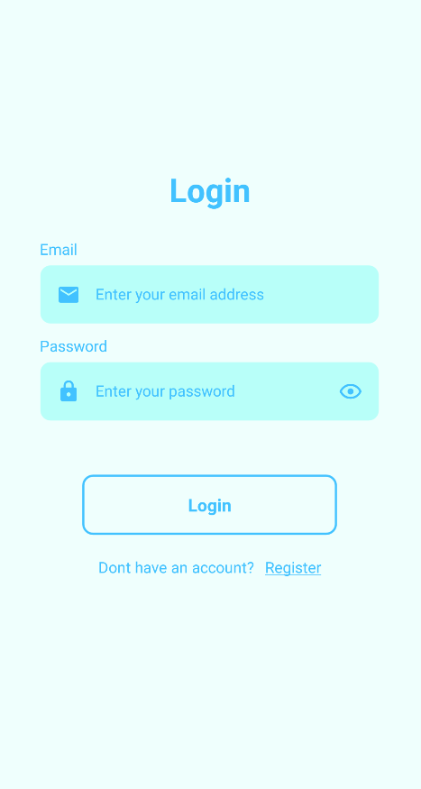
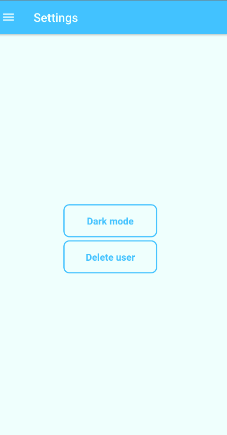

# Foodapp

This is a 2nd year OAMK mobile project that uses React Native for frontend and Node.js and MySQL for backend. Users can list their restaurant on it and order food from other restaurants.

---

## Getting started

### Installation

- Clone the project `git clone https://github.com/R15-Mobile-development-project/FoodApp.git`

### Database

- Import the database with the following command

```sh
mysql -u root -p <foodapp.sql
```

### .env

- Rename **.env.example** file for backend and frontend to **.env**
- Generate JWT_SECRET

```js
  > node
  > require('crypto').randomBytes(64).toString('hex')
```

- Fill rest of the fields with database credentials

### Launch the environment

- Start your emulator
- Start your MySQL database server
- Run `npm start` in backend
- Run `npm run android` in frontend

Your app should open and look like this and then just choose register. There you can choose if you are a restaurant owner.



After logging in you see the home page where you can order food from restaurants after adding money in the wallet page. In settings you can switch to dark mode or delete your account.



---

Creators Joni Pahikainen, Lasse Suomela, Tomi Laine, Hilppa Huhtanen and Juha-Pekka Kesonen
