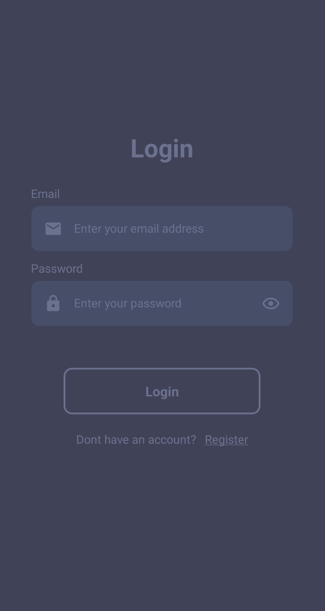

# Foodapp

This is a 2nd year OAMK mobile project that uses React Native for frontend and Node.js and MySQL for backend. Users can list their restaurant on it and order food from other restaurants.

---

## Getting started

### Installation

- Clone the project

  ```
  git clone https://github.com/R15-Mobile-development-project/FoodApp.git
  ```

### Database

- Import the database with the following command

  ```sh
  mysql -u root -p < foodapp.sql
  ```

### .env

Backend

- Create a new file **/backend/.env** and copy the contents from **/backend/.env.example** into it
- Generate JWT_SECRET

  ```js
    node
    require('crypto').randomBytes(64).toString('hex')
  ```

- Fill rest of the fields with database credentials

Frontend

- Create a new file **/frontend/.env** and copy the contents from **/frontend/.env.example** into it
- Replace the value of `API_URL` with the backend host and port

### Launch the environment

- Launch an Android emulator
- Start MySQL server
- Run `npm start` in backend/
- Run `npm run android` in frontend/

The app should open and look like this. Click on register, there you can choose to be a restaurant owner or a customer.



After logging in you see the home page where you can order food from restaurants after adding money in the wallet page. In settings you can switch to dark mode or delete your account.


---

Creators Joni Pahikainen, Lasse Suomela, Tomi Laine, Hilppa Huhtanen and Juha-Pekka Kesonen
