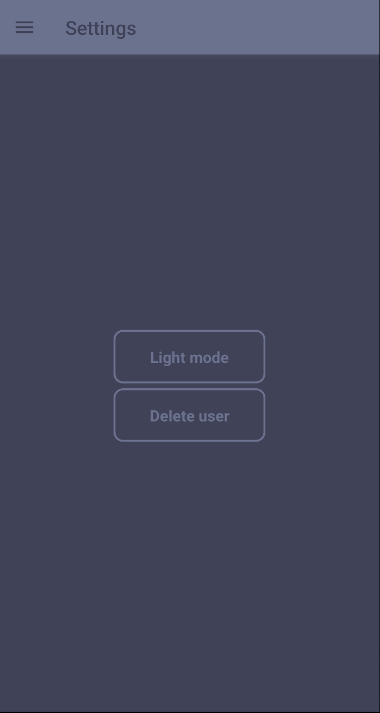

# Foodapp


This is a 2nd year OAMK mobile project that uses React Native for frontend and Node.js and MySQL for backend. Restaurant owners can list their restaurant on it. Normal users can order food from the restaurants.

---

## Getting started

### Installation

- Clone the project

  ```
  git clone https://github.com/R15-Mobile-development-project/FoodApp.git
  ```

### Database

- Import the database with the following command

  ```sh
  mysql -u root -p < foodapp.sql
  ```

### .env

### Backend

- Create a new file **/backend/.env** and copy the contents from **/backend/.env.example** into it
- Generate JWT_SECRET

  ```js
    node
    require('crypto').randomBytes(64).toString('hex')
  ```

- Fill rest of the fields with database credentials

### Frontend

- Create a new file **/frontend/.env** and copy the contents from **/frontend/.env.example** into it
- Replace the value of `API_URL` with the backend host and port

### Launch the environment

- Launch an Android emulator
- Start MySQL server
- Run `npm start` in backend/
- Run `npm run android` in frontend/

---
## Screenshots

The app should open and look like this. Click on register, there you can choose to be a restaurant owner or a customer.


After logging in you see the home page where you can order food from restaurants after adding money in the wallet page.


In profile page user can change their profile data and password


In settings you can switch to dark mode or delete your account.



After pressing order button on home page user can choose what items to buy


After the order is placed, it's shown in the order history page


---

Restaurant owners can add their own restaurant to the app


After they have added a restaurant they can choose to edit it or delete it


---

### Creators Joni Pahikainen, Lasse Suomela, Tomi Laine, Hilppa Huhtanen and Juha-Pekka Kesonen
